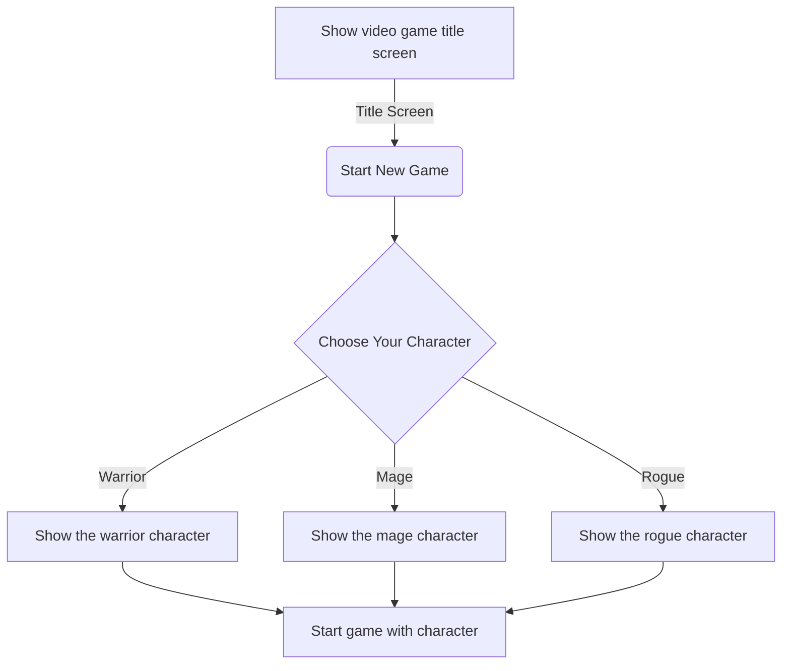

### Game State Flowchart

## Description
This diagram shows the relationship of events when launching a video game where you can play as different characters. After the title screen is shown, the option to select a character appears, allowing the player to view the character before starting the game with them. 
